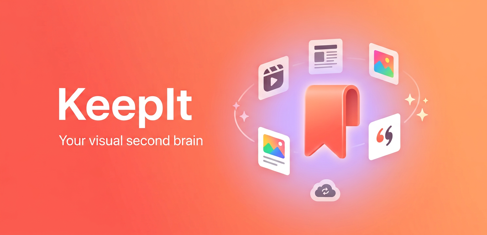
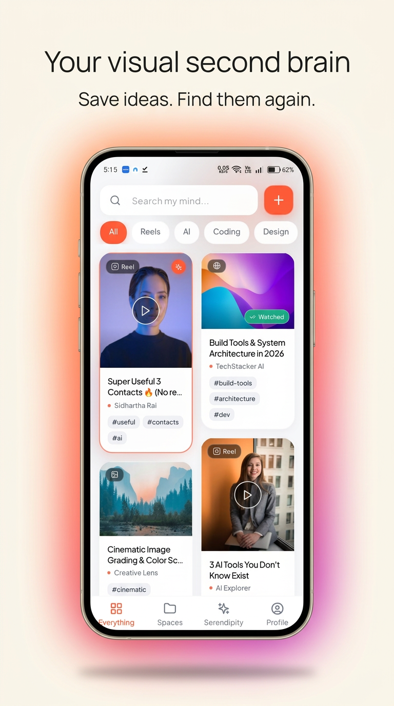
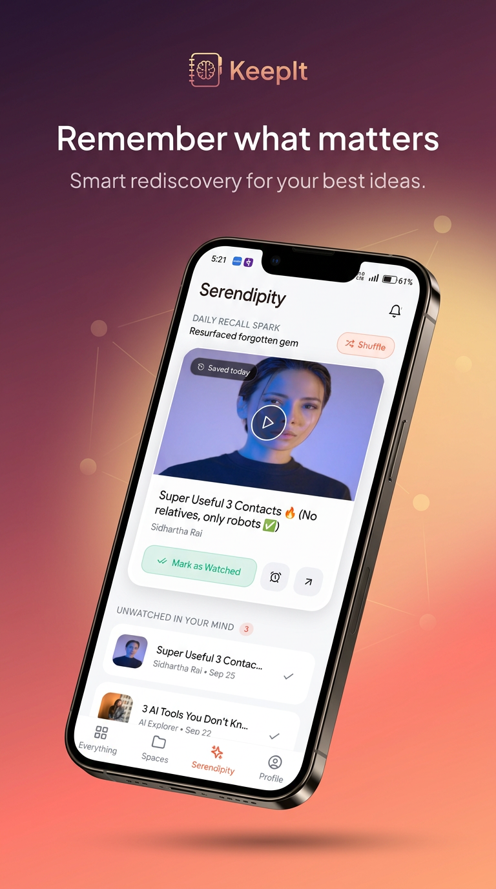
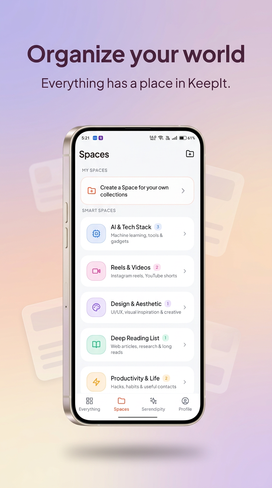
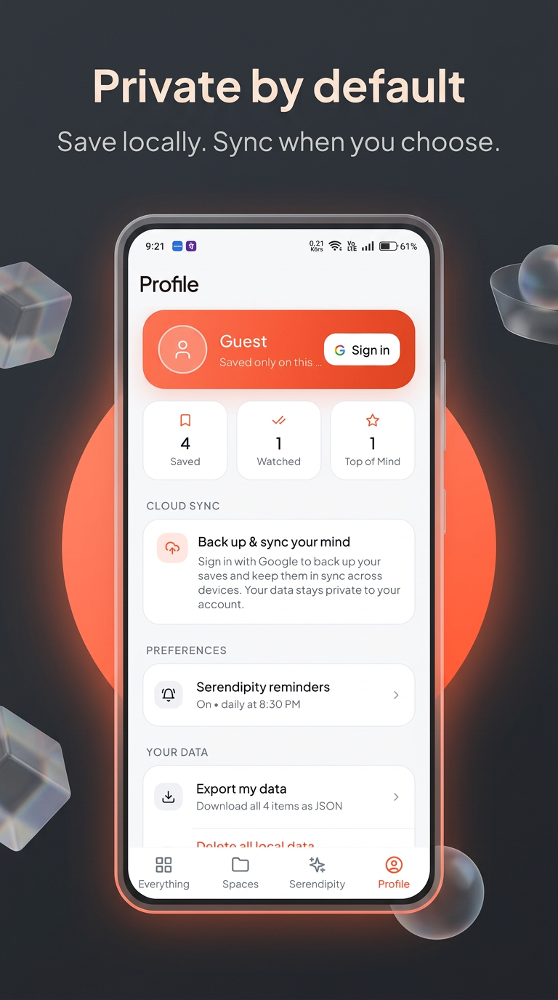
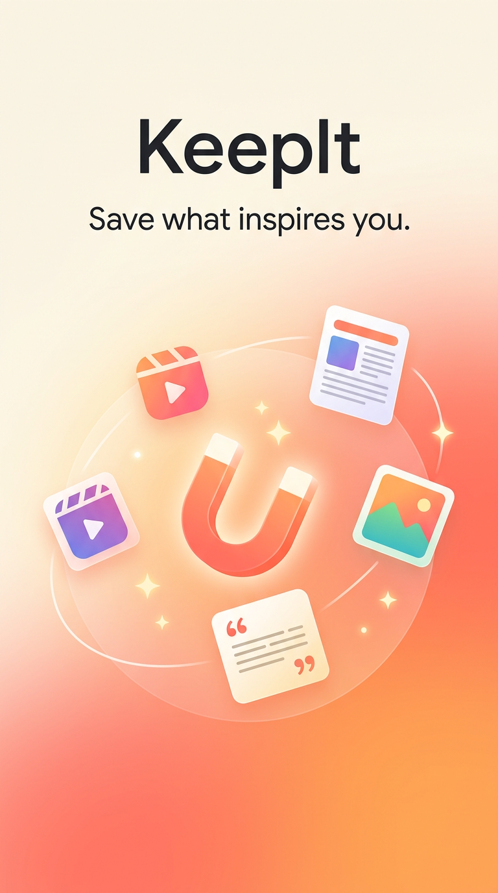
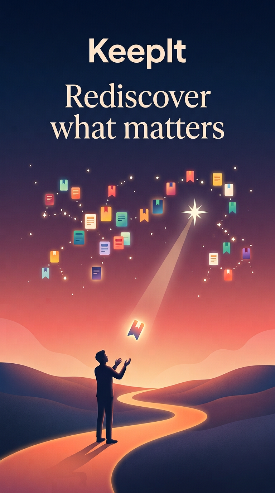
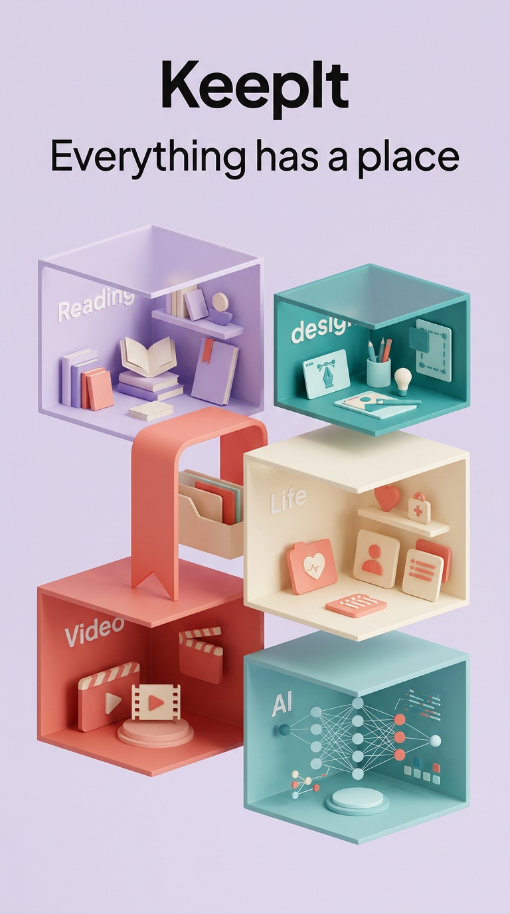
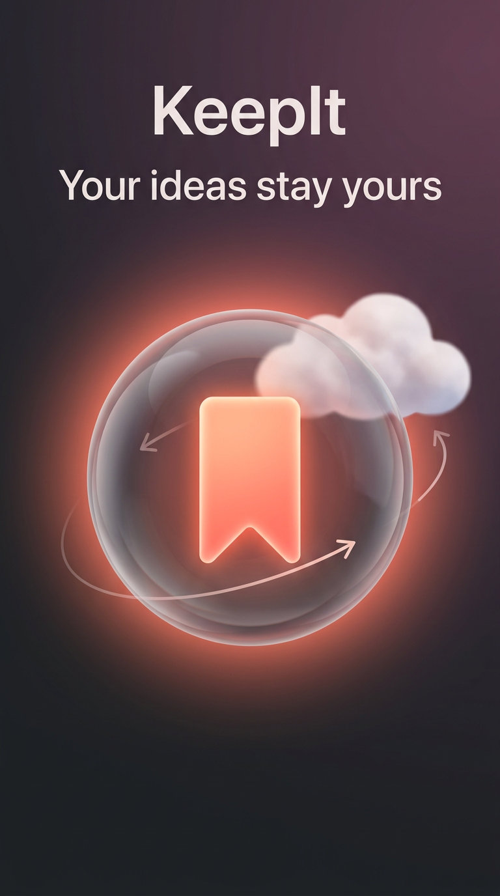
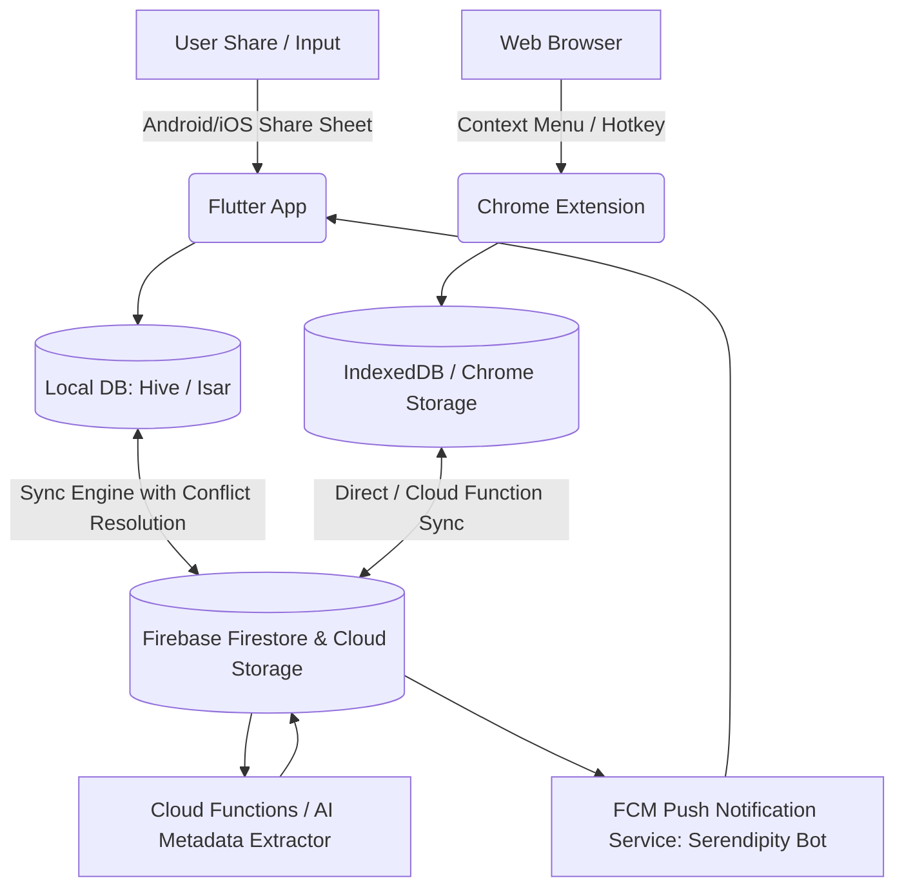

# KeepIt - AI-Powered Second Brain & Smart Visual Bookmarks 🧠✨

> **"Never lose an idea, reel, article, or note again."**  \

<p align="center">
  
</p>

<p align="center">
  <b>Save less. Remember more.</b><br>
  A beautiful, private second brain for everything worth keeping.
</p>

<p align="center">
  <a href="#-why-keepit">Features</a> ·
  <a href="#-getting-started">Getting started</a> ·
  <a href="docs/PLAY_STORE_RELEASE_GUIDE.md">Play Store release guide</a>
</p>

## ✨ See KeepIt in action

<p align="center">
  
  
  
  
</p>

## 🎨 The KeepIt idea

<p align="center">
  
  
  
  
</p>

> KeepIt is a privacy-first, visually aesthetic second brain for mobile (Flutter) and desktop (Chrome Extension). Inspired by the beauty of mymind, engineered for effortless recall and privacy.

---

## 🌟 Why KeepIt?
Every day we scroll past dozens of insightful Instagram Reels, YouTube Shorts, Twitter threads, technical articles, and design inspirations. Bookmarking them on individual platforms means they get forgotten forever. 

**KeepIt solves this seamlessly:**
1. **One-Tap Share Target:** Share directly from Instagram, YouTube, Twitter/X, TikTok, Reddit, or your browser.
2. **Local-First Architecture:** Instant access offline with zero latency using local database (Hive/Isar/SQLite), seamlessly backed up to Firebase.
3. **Smart Serendipity & AI Recall:** Smart notifications remind you of items you saved days or weeks ago right when you need inspiration.
4. **Minimal Aesthetic UI:** Card-based dynamic masonry grid with tag clouds, color palettes, space categorizations, and distraction-free viewing.
5. **Cross-Platform Ecosystem:** Native Flutter App (Android & iOS) + Manifest V3 Chrome Extension.

---

## 📱 App Features Overview

| Feature | Description |
| :--- | :--- |
| **Visual Masonry Grid** | Dynamic Pinterest/mymind-style layout tailored for Reels, image cards, quote snippets, and link previews. |
| **Share Intent Receiver** | Accepts links, media, and text directly from Android/iOS system share sheets. |
| **Smart Metadata Extraction** | Automatically fetches title, OG image, author, favicon, and extracts core content. |
| **Spaces & Smart Tags** | Auto-categorize by hashtags, themes, or custom user spaces (e.g. `Design`, `Dev`, `Quotes`, `AI Tools`). |
| **Serendipity Engine** | Rediscovery tab + scheduled spaced-repetition reminders (day 3 / 14 / 45 / 90, max 1/day, Sunday Mind Digest) with Mark Watched / Remind in 1 Week buttons and deep links. See [docs/NOTIFICATION_ENGINE.md](docs/NOTIFICATION_ENGINE.md). |
| **"I've Watched / Read This"** | Track read/watch status so your active mind feed stays fresh and actionable. |
| **Profile & Cloud Sync** | Works 100% offline with no account. Optional Google sign-in (Profile tab) backs up & syncs items via Firestore (last-write-wins, tombstones, auto-sync). Export JSON, delete local data, in-app account deletion. See [docs/FIREBASE_SETUP.md](docs/FIREBASE_SETUP.md). |
| **Full-Text & Color Search** | Search through tags, titles, notes, domains, and even dominant visual colors. |
| **In-App Updates** | Publishing on Google Play makes a KeepIt-branded update screen appear inside the app on the next cold start — optional by default, forceable per release. See [docs/IN_APP_UPDATE.md](docs/IN_APP_UPDATE.md). |

---

## 🚀 Publishing

| Doc | What |
| :--- | :--- |
| [docs/PUBLISHING.md](docs/PUBLISHING.md) | Step-by-step Play Store release: keystore, AAB, Play Console, closed testing, checklist |
| [docs/IN_APP_UPDATE.md](docs/IN_APP_UPDATE.md) | In-app updates: the update screen users see, how to force an update, and how to test it (Play only) |
| [docs/FIREBASE_SETUP.md](docs/FIREBASE_SETUP.md) | Create Firebase project, SHA fingerprints, Google Sign-In, Firestore rules |
| [docs/PLAY_CONSOLE_ANSWERS.md](docs/PLAY_CONSOLE_ANSWERS.md) | Data safety, content rating, account deletion answers |
| [docs/PLAY_STORE_LISTING.md](docs/PLAY_STORE_LISTING.md) | Store title, descriptions, release notes |
| [docs/SECRETS_SETUP.md](docs/SECRETS_SETUP.md) | **Start here** — GitHub secrets for the AdMob IDs and `google-services.json`, plus Firebase/Play hardening |
| [docs/ADMOB_SETUP.md](docs/ADMOB_SETUP.md) | AdMob account, ad units, how the IDs reach a release build, "contains ads" declaration |
| [docs/IMGBB_SETUP.md](docs/IMGBB_SETUP.md) | Optional public image uploads with ImgBB; only URLs sync through Firestore |
| `store_assets/` | 512 icon, 1024×500 feature graphic, `generate_assets.py` (regenerates all app icons) |
| `docs/*.html` | Privacy policy, Terms, Delete-account pages (GitHub Pages) |

---

## 🛠️ Architecture & Tech Stack



- **Frontend App:** Flutter 3.x (Dart), Riverpod / Bloc for reactive state management.
- **Local Storage:** Hive / Isar / SQLite for instant local query speeds and offline capability.
- **Backend Sync:** Firebase Authentication, Cloud Firestore, Cloud Storage, Cloud Functions.
- **Chrome Extension:** Manifest V3, TypeScript/JavaScript, TailwindCSS popup, Background Service Worker.
- **Notification Engine:** Firebase Cloud Messaging (FCM) + Flutter Local Notifications (zoned schedule for spaced repetition).
- **Ads:** Google AdMob (`google_mobile_ads`) — anchored adaptive banner, rate-capped interstitial (post-save), opt-in rewarded "Support KeepIt". Non-personalized by default.

---

## 📂 Repository Structure

```text
keepit/
├── docs/
│   ├── ARCHITECTURE.md          # Technical architecture & sync engine spec
│   ├── APP_FLOW_AND_UI.md       # Complete screen wireframes & interaction flows
│   ├── ASO_PLAYSTORE_STRATEGY.md# App Store Optimization & launch strategy
│   ├── CHROME_EXTENSION_SPEC.md # Chrome Extension Manifest V3 architecture
│   └── NOTIFICATION_ENGINE.md   # Spaced repetition & serendipity algorithm
├── flutter_app/                 # Complete Flutter Mobile Application codebase
│   ├── lib/
│   │   ├── core/                # Theme, constants, network, utils
│   │   ├── data/                # Local database (Hive), Firebase repos
│   │   ├── domain/              # Entities and use cases
│   │   └── presentation/        # Screens (Masonry feed, Detail, Spaces, Serendipity)
│   └── pubspec.yaml
├── chrome_extension/            # Manifest V3 Extension for 1-click web bookmarking
│   ├── manifest.json
│   ├── popup/
│   ├── background/
│   └── icons/
└── README.md
```

---

## 🚀 Getting Started

### Prerequisites
- Flutter SDK (v3.19.0 or higher)
- Dart SDK
- Chrome Browser (for extension testing)
- Firebase Project configured (`google-services.json` / `GoogleService-Info.plist`)

### Quick Setup

```bash
# Clone the repository
git clone https://github.com/Keshab1997/keepit.git
cd keepit

# Run Flutter App
cd flutter_app
flutter pub get
flutter run
```

> 🔐 **A plain checkout builds an ad-free, offline-only app.** The real AdMob
> IDs and `google-services.json` live in GitHub Actions secrets and are injected
> by the release workflow — they are deliberately not in this repository.
> See [`docs/SECRETS_SETUP.md`](docs/SECRETS_SETUP.md) if you are setting up a
> release pipeline (or a fork) of your own.

# Load Chrome Extension
# Open chrome://extensions -> Enable Developer Mode -> Load Unpacked -> select 'chrome_extension'
```

---

## 📄 License
Licensed under the [MIT License](LICENSE). Built with ❤️ by [Keshab Sarkar](https://github.com/Keshab1997).
